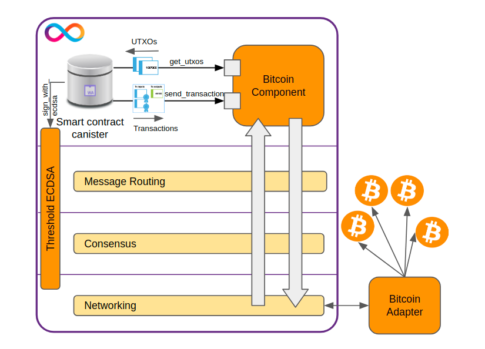

= Report on IC’s Bitcoin Integration
:toc:

_In the fulfillment of the Dfinity Development Grant, this report provides a comprehensive study on the Bitcoin Integration into the Internet Computer Protocol (ICP)._

== 1. An overview on ICP

Dfinity Foundation has a grand vision to build ICP to be easy, flexible, secure for dapps, and scalable at web speed. We point out the most significant characteristics of ICP.

* ICP is a new generation of layer-1 blockchain platform that offers subnet architecture and unlimited scalability.
* ICP fundamentals are based on Chain-Key Cryptography (including threshold BLS signature scheme and non-interactive distributed key generation) which is a great advancement in Blockchain Technology.
* ICP uses WASM for its stack-based virtual machine which has many advantages over EVM & Solidity. WASM is used by EOS and in the future plan of Polkadot, Cosmos, Ethereum 2.0 and others layer-1 blockchains.
* Dfinity develops Motoko as a native smartcontract language, specialized for ICP’s canisters (i.e. smart contracts). Motoko is a distinguished innovation in the blockchain space.
* ICP consensus enables high throughput for the entire system and each subnet.
* ICP provides an end-to-end and efficient solution to build dapps entirely on blockchain, which is unique and distinct from all others in the space.
* ICP enables a more stable gas fee structure (in terms of cycle conversion) for developers  which is also more friendly to end users (as they don’t have to pay gas for transactions).
* ICP allows cross-canister massaging and direct cross-chain interoperability with other chains (showcases are Bitcoin integration, and Ethereum integration).

We conducted a tech talk to discover the overview of ICP architecture and technologies:

* Web-Seminar https://www.facebook.com/groups/vietnamblockchaininnovation/permalink/731714674867497[link]
* https://www.youtube.com/watch?v=MlnFVn-Ae64[Recorded video] on Youtube
* https://drive.google.com/file/d/1V1G2w5ehdAtC4Jy8CiClV4r22yVuuhOq/view?usp=sharing[Presentation PPT]

We also translated the ICP Whilepaper into Vietnamese (Google Drive link  https://drive.google.com/file/d/10tmcGdounjaxHLM4Sbps95P1XvRs2TfI/view?usp=sharing[HERE]) so many developers and audiences speaking Vietnamese can understand what ICP is and will be.

== 2. Overall on Bitcoin integration
This is a brief from https://wiki.internetcomputer.org/wiki/Bitcoin_integration

The major features of Bitcoin integration:

* Canisters can have Bitcoin addresses (and therefore receive and hold bitcoin directly on the Bitcoin blockchain). (in progress)
* Canisters can access the UTXO set of Bitcoin addresses.
* Canisters can securely sign Bitcoin transactions. (in progress)
* Canisters can submit Bitcoin transactions to the Bitcoin network.

The components:

* *Bitcoin Adapter*: connects directly to a predefined Bitcoin network from the config file and starts a local RPC node for listening requests from the canister. With this RPC server, the canister can fetch all blocks and send signed transactions through the Bitcoin adapter.

** Address Book: store Bitcoin network nodes from the config file
** Blockchain Manager: sync and process receive block from blockchain
** Blockchain State: Handle state, header, and fork chain
** Connection Manager: make connections, handle ping/pong nodes, and limit connections to the blockchain.
** Transaction Manager: get and send a transaction with raw data to the Bitcoin node.
** RPC Server: Listen to request from Canister. Handle block requests, and transfer signed transactions to Bitcoin Network.

* *Bitcoin Canister*: connects to the Bitcoin network through the Bitcoin Adapter. It fetches blocks and stores UTXO sets locally. So we can check the BTC Address balance or get address UTXOs in Canister locally without calling to Bitcoin Adapter
** UTXOs: Store all UTXOs for each Bitcoin Address from genesis in Canister. The StableBTreeMap implementation has been amazingly efficient in memory management.
** Transaction: Request replica with consensus mechanism to sign a transaction signature into transaction payload and transaction will be sent to Bitcoin Network through Bitcoin Adapter

.Bitcoin Integration Architecture

== 3. Bitcoin canisters on ICP

* Creating a Bitcoin transaction requires computing one ECDSA signature per UTXO used as transaction input. Canisters can request ECDSA signatures through a threshold ECDSA API that is implemented as part of dedicated ECDSA signing subnets.
* In https://github.com/dfinity/bitcoin-developer-preview/tree/master/examples[bitcoin-developer-preview] demo. Canister can send transactions by locally generating a signature from a predefined private key. This way can not be used in prod. It requires that the private key be stored in every replica and if one replica is breached, the private key is breached as well.
* In-progress . At this time I wrote this report. No API for Threshold ECDSA signing feature. So Canister can not get signatures for transactions from subnet.
** Latest update (27/04/2022) - Threshold ECDSA feature can finished at end of May 2022
** https://forum.dfinity.org/t/threshold-ecdsa-signatures/6152/156
** https://forum.dfinity.org/t/direct-integration-with-bitcoin/6147/266

== 4. More on threshold ECDSA & DKG
=== 4.1. ECDSA threshold signature schemes for Bridge systems
==== 4.1.1. Blockchain systems adopting ECDSA
ECDSA, short for elliptic curve digital signature algorithm, is a form of DSA - https://csrc.nist.gov/glossary/term/digital_signature_algorithm[digital signature] algorithm, which utilizes elliptic curve cryptography. It has been http://ethanfast.com/top-crypto.html[adopted] by many popular blockchain systems, which are Bitcoin, Ethereum, etc. Depending on the original design the parameter for the elliptic curve will change, to be suitable for each system.

Cryptography used by the popular blockchains:

|===
|Name |Symbol |Building blocks |Signing Algorithm |Curve Parameter

|*Bitcoin*
|BTC
|Elliptic curve
|ECDSA
|secp256k1

|*Ethereum*
|ETH
|Elliptic curve
|ECDSA
|secp256k1

|*Polkadot*
|DOT
a|
* Elliptic curve
* Schnorr Group
* Edwards curve
|ECDSA, Schnorr, EdDSA
|curve25519, ristretto25519, secp256k1

|*XRP*
|XRP
a|
* Elliptic curve
* Schnorr Group
* Edwards curve
|ECDSA, EdDSA
|curve25519, secp256k1*

|*Cardano*
|ADA
|Edwards curve
|EdDSA
|curve25519

|*DogeCoin*
|DOGE
|Elliptic curve
|ECDSA
|secp256k1
|===

==== 4.1.2. Digital Signature Algorithm and Threshold Signatures
DSA is a standard for digital signature from the Federal Information Processing Standard (FIPS), developed by National Institute of Standards and Technology (NIST). DSA was officially proposed in 1994 in FIPS-186. It contains the use of EC curves in the process of key generation and signature verifications.

In the version 4 of FIPS-186 (the current standard) contains guidance and steps of the DSA algorithm, which can splitted into 4 operations:

* Key Generation
** parameters selection (curves and curves parameters, ex: elliptic curve and https://en.bitcoin.it/wiki/Secp256k1[Secp256k1])
** per-user key pair management
* Key Distribution
* Signing
* Signature Verification

In the threshold version of DSA, any group of t (for threshold) or more players can together reconstruct the secret but no group of fewer than t players can, such a system is called a https://en.wikipedia.org/wiki/Secret_sharing[(t, n)-threshold scheme]. In addition to that, Key Generation and Key Distribution, there is no guidance in FIPS-186-4 on how to securely set up a mechanism to exchange public keys between parties to create a shared secret (signature). There’s a solution for that problem, that is DKG, which provide secret maintenance based on secret sharing scheme, which following operations:

* Distributed Key Generation - Generates of shares of a random value, which is never known to anyone
* Proactive Refresh - Regenerates new shares for an existing secret, eliminating utility of old shares (which might have been exposed)
* Share Recovery - Rebuilding a lost or destroyed share without having to restore the secret or expose any share

=== 4.2. Distributed key generation protocols
To prevent a single point of failure in the DSA process, a distributed key generation must be used. And there is a list of protocols in a https://eprint.iacr.org/2020/1390[survey] of Tarus Group, which are ECDSA threshold signing protocols and analyzed in a particular criteria to compare. For the meaning of criteria:

Explanation:

* Elliptic Curve Diffie Hellman Key Agreement (ECDH) - https://en.wikipedia.org/wiki/Elliptic-curve_Diffie%E2%80%93Hellman[ECDH] is a Key Agreement Scheme commonly used in https://en.wikipedia.org/wiki/Transport_Layer_Security[TLS handshakes]
* https://en.wikipedia.org/wiki/RSA_(cryptosystem)[RSA (Rivest–Shamir–Adleman)] is a https://en.wikipedia.org/wiki/Public-key_cryptography[public-key cryptosystem] that is widely used for secure data transmission
* *Hardness Assumptions*: the fewer assumptions the better.
* *Adversary*: Static means the adversary must choose which participants to attack before the starting of protocols. Adaptive means the attacker can wait until after the protocol has started to choose which participant to corrupt.
* *Majority*: The fraction (at least half) of participants who are honest, called honest majority. That is, out of n participants, at least (n−1)/2 follow the protocol as described and don't try to attack. The dishonest majority setting allows for the adversary to corrupt most but one participant. A protocol secure under this model must be safe with a (n − 1, n)-threshold configuration, where all participants, except one, are corrupted, and all n participants must cooperate to sign a message.
* *Performance*: mostly affected by network latency, which can be compared by units, called rounds. In each round, each party sends a message to some set of parties or broadcasts a message to all the other parties.

|===
|Protocols |https://eprint.iacr.org/2018/987[Lindell] |http://eprint.iacr.org/2019/114[GG18] |https://eprint.iacr.org/2019/523[DKLS] |https://eprint.iacr.org/2020/501[Damgard] |http://eprint.iacr.org/2020/540[GG20] |https://eprint.iacr.org/2020/492[CMP] |https://hal.archives-ouvertes.fr/hal-02944825[CCLST] |https://eprint.iacr.org/2020/498[CCLST]

|Majority
|Dishonest
|Dishonest
|Dishonest
|Honest (t ≤ (n − 1)/2)
|Dishonest
|Dishonest
|Dishonest
|Dishonest

|Adversary
|Static
|Static
|Static
|Static
|Static
|Adaptive
|Static
|

|Assumptions
|DDH, Paillier indistinguishability
|DDH, strong RSA
|ECDH
|None beyond ECDSA security
|Enhanced ECDSA, DDH, strong RSA
|Enhanced ECDSA, DDH, strong RSA
|Low order and strong root assumptions (with respect to class groups of quadratic fields)
|DDH (+ others depending on commitment scheme, MtA used)

|Performance
a|
* Setup: 5 rounds
* Signing: 8 rounds
a|
*  Setup: 4 rounds
* Signing: 9 rounds
a|
* Setup: 5 rounds (key generation) + 3 rounds (“auxiliary setup”)
* Signing: 6+dlog te rounds (only the last is online)
a|
* Setup: 3 rounds
* Signing: 4 rounds (including 3 offline, +2 with fairness)
a|For identifiable case:

* Setup: 4 rounds
* Signing: 7 rounds (including 1 online)
a|
* Setup : 3 rounds
* Key refresh: 2 rounds (3 without range proofs)
* Signing: 4 rounds (including 3 offline)
a|
*–* Setup: 5 rounds
* Signing: 8 rounds
a|
* Setup : 4 rounds
* Signing: 13 rounds (including 10 offline)
|===
====
Existing implementations

*Audited*

* https://github.com/ZenGo-X/multi-party-ecdsa:
** Protocols: GG18, GG20
** Language: Rust
* https://github.com/binance-chain/tss-lib:
** Protocols: GG18
** Language: Go
* https://github.com/coinbase/kryptology:
** Protocols: GG18, GG20, DKLS
** Language: Go

*Non-audited*

** https://github.com/taurusgroup/multi-party-sig
====

=== 4.3. The proposed DKG protocol
GG20 is a good option for Bridge cases, which use ECDSA threshold signatures. It’s widely used by big players in the blockchain industry; some of the libraries are audited and battle-tested.

There’s an attack to this protocol, called “Alpha Ray” https://hackmd.io/@omershlo/Sk_8JT-qt[attack]. In which, an adversary can obtain the reconstruction of the shared signature. However, several GG20 implementations have https://github.com/coinbase/kryptology/pull/16[released patches] to address this attack.

== 5. Deploying Bitcoin integration on local environment

.IC Bitcoin Adapter receiving block from Bitcoin Node

.Canister Log

.Shim Adapter Logs

.Get Address Balance and UTXOs

== 6. Conclusion and further work

ICP enables a direct integration with Bitcoin and other chains without conventional bridges. This is a distinct feature only available on ICP which can make ICP an interoperable hub in the blockchain space to execute transactions and/or exchange any pair ofcrypto-currencies. However, a lot of work needs to complete the solution and bring the feature to users.

In the next sprint, we are going to study Dogecoin (and/or Cardano) UTXOs and their signature schemes, then propose a feasible integration concept on ICP which is similar to the Bitcoin integration.

